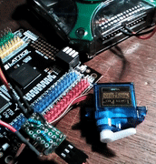

# mm-supa-challenge

My personal stretch goal of implementing the [mm-challenge](https://github.com/essess/mm-challenge) in hardware --- nothing like something you can touch and tinker with. This is only slightly different from the mm-challenge in that I've added a PLL to get (an almost) 100MHz from 12MHz and have syncronized/debounced/filtered the start button and the data stream input. The data stream is generated by my Analog Discovery box.

Implemented on a Lattice MachX03 Starter Kit.

